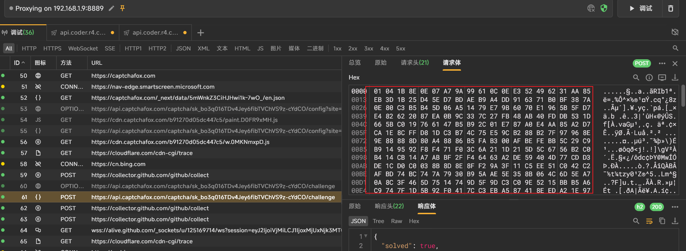
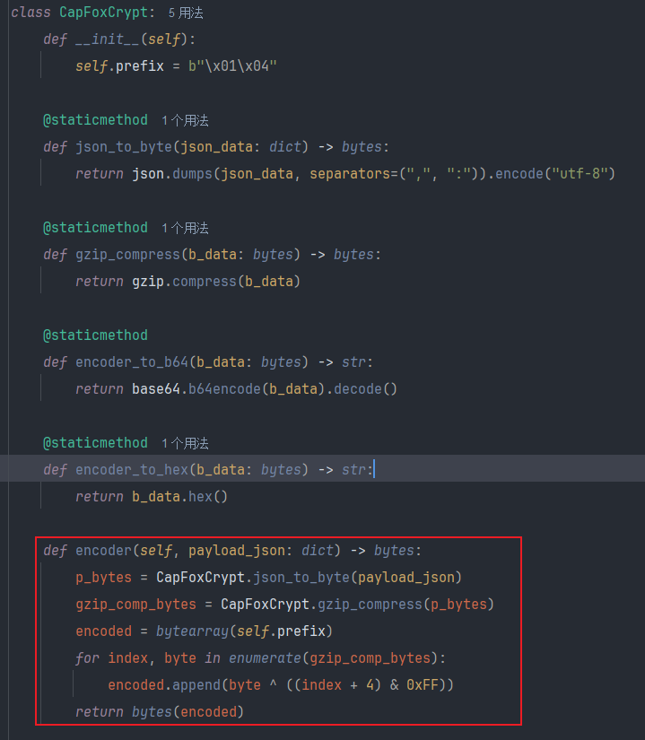
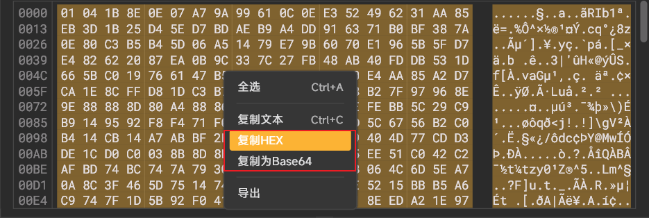
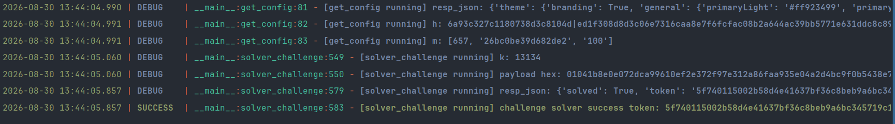

# CaptchaFox Challenge Solver
使用纯python协议复现CaptchaFox(https://captchafox.com/)挑战的请求链路

# CaptchaFox Website Demo: 
https://captchafox.com/

# 项目结构
```text
│  LICENSE
│  README.md
├─asset
│      Capfox_encode.png
│      Capfox_reqabe_1.png
│      Capfox_reqable_2.png
│      Capfox_result.png
└─src
    │  code.js ---> 加密body的算法,纯扣js
    │  main.py ---> 主程序
    │  payload_crypt.py ---> 加密body的加密解密算法
    │  typedarrToBase64.js ---> 工具函数
    │
    └─__pycache__
            payload_crypt.cpython-310.pyc
```

# CaptchaFox Challenge Introduction
1.首先请求一次如下获取配置接口:
```text
https://api.captchafox.com/captcha/{site_key}/config
```
响应如下内容:
```text
{
  "theme": {...},
  "h": "6a93939f67e58c80d46b859f|b991fd5951ee248fc906a9a541cabb4cae2e93c441393356f0f5015f43320d42",
  "m": [855,"0d3f3dd9518852c4","100"]
}
```

其中尤为重要的是h和m,h需要在challenge接口中进行携带,m参与计算得到加密body的k

m计算得到k算法如下:
```python
import hashlib
def proof_of_work(params: list) -> int:
    """
    找到使 SHA-256 哈希前导零数量达标的 nonce
    """
    if len(params) != 3:
        raise ValueError("bad input")

    base_string = params[1]
    required_zeros = int(params[2], 2)
    nonce = 0

    while True:
        hash_hex = hashlib.sha256(f"{base_string}{nonce}".encode()).hexdigest()
        if hash_hex[:required_zeros] == "0" * required_zeros:
            return nonce
        nonce += 1
```

2.提交加密body完成挑战接口

需要提交加密的body数据:


加密算法主要是gzip压缩 + 自定义异或规则


加密的明文是一个json数据,如下:
```json
{
  "lng": "zh-cn",
  "h": "接口返回的h",
  "cs": "采集的指纹数据",
  "host": "captchafox.com",
  "k": "通过接口返回的m计算",
  "type": "slide"
}
```

当然的,也可以通过我写的反解函数进行解密加密的body.

首先将加密的数据复制为hex或者base64:


在payload_crypt.py文件中进行调用:
```python
class CapFoxCrypt:...
if __name__ == '__main__':
    cap_cry = CapFoxCrypt()
    # 粘贴复制的hex或者base64
    result = cap_cry.decoder(
        "粘贴复制的hex或者base64"
    )
    print(result)
```

验证通过了会返回如下json,尤为重要的是这个token
```json
{
  "solved": true,
  "token": "782707aff2223fb15cc4d1c2dccbe303a1fe16abf78f37a06d6b4998b254805b",
  "ttl": 180
}
```
# 成品展示


# 笔者遇到的一些坑点

1.加密body的明文json对象中的k不能固定,他必须根据配置接口返回的m计算得来,如果固定了,则会触发验证码挑战.

如下为k值不对,请求挑战接口所返回的json
```json
{
  "ttl": 180,
  "h": "6a93c205ae13c230b1e7d139|cc098942da8198c171a21bc2bdccd35bd912e194f8e094ef4a94a859fc135ab5",
  "j": [
    865,
    "4d11dcf869094a02",
    "101"
  ],
  "i18n": {
    "slide": {
      "buttonPrompt": "向右滑动",
      "prompt": "将足球移动到水晶球"
    }
  },
  "type": "slide",
  "challenge": {
    "bg": "data:image/png;base64,iVBORw0KGgoAAAANSUhEUgAAAlgAAAB4CAYAAAAuVYzDAAAABHNCSVQICAgIfAhkiAAAAAFzUkdCAK7OHOkAABDsSURBVHic7d17cFTnfcbx5z270q4EkpCQEMKAwNggDM7YxMYdnMSmnUzrpLk5WE49bVJ32kmd1JmCMpl2mul4ppdJZipw3aQk6Xicjt1OvLKdaxNPnQwhTpjY8S1uMBJgzEUILBAIoctKu3ve/gF2jI3NSjpn3z1nv5//kPb83odhWD16z9lzJAAAAATKuA4AAOUus/VIk9H4nbL+Kit9SDILZzbJ7rbyvpcw6tu0ZdV/Bp0TQPmgYAHAG2Tu29eiQuEm+fYeyawpzarmB0om7lHbihc6O02hNGsCCBMFCwDO69nW9+fWt99w+N54IpEwH/z4X6/6laP1AQSEggWgoj3c3fs1I33adY638ZnOro7trkMAmD4KFoCK09Pd93tW9seucxTNakjenJWdW5acch0FQHE81wEAoFSstV7Ptr23RqpcSZLRfNnRw4/et2+x6ygAisMOFoCK8HB375eN9AXXOYJgZG+8rWv1Ltc5ALw9ChaAWMt0931fsn/oOkfgrIZk7Oc7u1Z/03UUAG9FwQIQWz3/0vsFa/Rl1zlCVZVY0/m5K19yHQPAhShYAGInc2/fe1Sw/y1pSRDzJrNT+vVTvRf93roNVylZlQximRkzsl9tbkp/fuOdy7NOgwB4HQULQKxkunuflPSeoOYNHB5U/yvH3/E1xkjXv+9dQS05Y570J5u6Oh5ynQMAnyIEECOPbN23Jshydbz/5CXLlSRZK506eSaoZWfMlx601vKLM1AG+I8IIBYy3b1ZSakgZz6988VpvX79Te53sc6xOzu7Vt/sOgVQyShYACItk7EJHenLBz13/55DOjU4vV2p1sXNal+xKOgoM3Wis6tjgesQQKXiFCGAyPr+1wdq1d/3/TBmnzl1tiTHhKilZ1vfLa5DAJWKggUgkqy13sToyJisQikRhbw/7WOy45PKTeXCiDMj1rc/zHT3jrjOAVQiChaASOrZ2ldwneHNPM+oqrrKdYw3q8t09+53HQKoNBQsAJHzyNbevwx7jVR6+kUpXRvoNfZBWvHd+3vrXIcAKgkFC0CkZLr3jPlW28NeZ8Xq9mkfc8VV0z+mVCaHNdKzdQ+P1QFKhIIFIDLOFQRTW4q15tZPf5l0TdnuYEmSrDWfyty37yrXOYBKQMECEBnWmk+Vcr2l07jlwhVrynf36gK5fI/rCEAl4D5YAMret7e9Mi/nZ1+QjJMW8+wvdquQv/g19cmqhFasXqqGxuhc4mSkzbd1ddzrOgcQZxQsAGUv091rXWew1mrk9KhGR8bPfcFIi5YukDGRfRv9VWdXx3rXIYC4cvsIeAC4hO/e31s3Oew6hWSMUUNTnRqaorNTdQnXuw4AxBnXYAEoa5PDOuE6Q1zxqUIgPBQsAGXrkW19Hw36Ac74LWvNpzIZm3CdA4gjChaAsvTd+3vrfN/e5zpHKeWm8jo9dEYDhwd18tXTyk5Mhr6mOdJ3d+iLABUosldnAoi3THfvUUnF3ychgk6fPFemxs5OXPK1yWRCV69fpaqq4C+d9Yzu2rSl42uBDwYqGDtYAMqOtdbEuVxZ3+rpnS9q3+5DRZUrScrnC3p+10t6eueLGj07HmieUtwZH6g0FCwAZefRe/d+xHWGsExNTumlF16e1Yw9szz+Ys6XWgAB4T8UgLJTDve9CsOh/Uf16tGhwOala6r1rvUdAU2zOzu7Vt8c0DCg4rGDBaCsPLZ9/wLXGcKQnZgMtFydmzmlg/v6A5pmbgpoEAAKFoByUxjP3+E6Q9AKhYL2/uZgKLMHB04FNuuZr9uqwIYBFY6CBaBsPPJvfR1W2uY6R9Ce3/WSsuPh3XIhqF2sA6N9DwYyCAAFC0D58Kfs/7jOELTxsax8P9xLygYHTulA35EgRt2e6d7zp0EMAiodBQtAObncdYCgDb16ujTrDAb1wEbziYAGARWNggUAITp2pDSPUrTB7ZL9flCDgEpGwQJQFs4/dxCzMJmdch0BwHkULABlwbeWezDNUm4qH8iczNYjTYEMAioYBQtAebD6nOsIUTc6EtQjdMb+PqBBQMWiYAEoFzxZYpYK+UIwg6zuDmYQULkoWAAQE6l0YPcJ5WcDMEv8JwLgXCZjE64zxEHt3BrXEQCcR8EC4Jx3dO+HXGeIAwoWUD4oWACcs75d5jpDWBJJNueASkTBAuCclY3tPbDaV7SVZJ10bSrQeT3b9nDbDGAWKFgAykFsd7CaF4Z/S6maOWldfd3KQGcaazoCHQhUGAoWgHKQdh0gTLVzwv3rLV7WKmOCvcuFtfH+NwHCRsEC4NSOB15JS6bVdY4wrb1upVoXN4cyO5H01NjcEMbohWEMBSoFBQuAUyfGNc91hlJoX7FItXOD3xR6941rA58pSb4q498FCAsFC4BTnj9VMT/IV65dHui8y9rD2/gzFCxgVpKuAwCobL5XPSxNuo5xgeGhEe3fc1h+wb/o95evXKyWtulfvF6dqtL6m67WwOET6n/l+IzzpWtTetf1q2Z8fDGsNBzqAkDMUbAAONVSq+ETWdcpznm597CGXr10r3hlb79e2duvmjkpXX3ddIuO0aKlC7Ro6QLtfm6fxs5OFH1k25IWtS1doGQJ7q3lUbCAWeEUIQCnNt65PKsy2MLK5/JFlas3mhib1NjZ8RmvuWbdlVq5dplS6epLvnbpijYtubytJOVKkqwxFCxgFtjBAuCe1UEZhXvO6x289Px+jY7MrCjtfm6/klVJrdtw1YyOnze/XvPm18/o2DAZ6aDrDECUsYMFwD3j7of5yPDojMvVa/K5vI4efDWwTOXAsx4FC5gFChYA94x6XS199FAwxej40ZOBzCkXnpd09m8CxAEFC0A5eNzVwmeHxwKZU8gXzn32LiY+tnk512ABs0DBAuDe4lVPuFj2zKmzgc47cmDmt14AEC8ULADOdXaagot1Z3vt1VvmzeIThQDihYIFoGKNjxV/D6pijAVc2ABEFwULQLm4+G3TQ5Sbygc6z/etfL/kf43gGf2r6whA1FGwAJSL/yv1glXVwd4KMJFMyPOi/7bqGfNT1xmAqIv+OwGAWPA8c0+p12xqCfZ5xg1NcwOd58qmzau+4zoDEHUULABlwcUP9fkLgi1Yy1cuDnQegOiiYAFAQBKJ0jwnMGTxuZkX4BAFC0A5OVDqBa9c0x7InNbFzYHMcc/+mesEQBxQsACUDa/afLDUazY2N6imNjWrGV7CU/uKRYFlcujhzq7V33QdAogDChaAsrHp7lW9kn5d6nWvWNMuLzHzt8NlV8SiXMnzzLdcZwDiwrgOAABv9Nj2/Qvy4/lgnsA8Tb95dp/GR4u/+WiyKqF1G9aEmqmUOrs6+JkABIT/TADKTqa719mF1oVCQccOn9DA4cG3fU1za6MuW9aqVLq6pNnCZXd2dq2+2XUKIC6CvcseAATB2KdkzQ0ulk4kElq8fKEamup05MAxTYxnVcj78jyjVE1Ki5e3qnF+g4to4TLmS64jAHHCDhaAsmOtNT1b+2LwzJno4PQgECwucgdQdowxVtJe1zkqh73TdQIgbihYAMqSZ7TNdYYKcaxlXcdDrkMAccOWMICyldna+wey+pHrHHHGqUEgHOxgAShbnVs6Hpc06TpHXFnp664zAHFFwQJQ1qwsn24LSe1c80XXGYC4YmsYQNlzeV+sGHums6vjetchgLhiBwtA2avyUo2SDrrOERdG2ky5AsLFDhaASMhs7Vsva59ynSMOuLAdCB87WAAioXPLqqcl/cR1jqhLJMx61xmASsBvMQAiJdPdW+CXwxnb0dnV8buuQwCVgDcpAJHiGX3WdYZosruTqbm3uU4BVAp2sABEEp8snJaBzq6Oy1yHACoJO1gAIqll3aoq1xkiIku5AkqPggUgkjZuNHkZ/dR1jvJm80YepwUBBzhFCCDSduywyRPP9eVc5yhDZzq7Oua5DgFUKgoWgFjIdPf6vKe9xu7u7Fq91nUKoJJxihBALBhj7pBs3nUO9+xOza2+0XUKoNIlXQcAgCDs/fGdvfILP2y/8csfrq5d6DqOE6cO/kBD+3oSntENkv7XdR6gkrGdDiDy/vmW37nRWv/nr/153tL3q/nKP5LxKuN3yOyZl3Xsxa8onx16/Wue8f74b3/0y/9yGgyoYJwiBBB51tqH3vjn4cNPqP+Zf3QXqMT6n/mnC8qVJPmy250FAkDBAhAHdtmbv5I9c0D7nvjkW4pHfFiNDPxc+574pKx/kUvPrK1zkQrAOZwiBBBpX/rADR8p+PY7l3rdomu2aE7LNaUJFbLBPQ/oTP+OS76uprrqK1u+94u7SxIKwAXYwQIQacubGjcV87qBF7ZGfzfL+jrT/5OiypUkXXvZwo+FngnARbGDBSCydnzm1ttl9S3fSr882F/0cXNartWiazaHmi1Ifn5Ch3b9jfKTp4t6fW11la65rPX8n8xXN25/9K9CDQjgLShYACJrx10fn5Ls688kzOYLeu7IsWnNaF3zF6pf9N4w4s1asacCX5P0PK1vX/SWr2/c/hjv9UCJVcZnmAHElL3ggc/pZELtTQ06dOpM0RNe3f0fGh18VvVtGzS3dX0YIadt6OVHdfbYLuUmTkzruGuXVOb9v4ByxG81ACLpybvuaMwre+rtvn8mO6ndx6ZXUCQpUTVXNY0dalpxq1JzF882ZlHGTrygoQPf1uTZQ5L1p3WsMUY3tC+SZ97h7dwkbtn47z2Pzz4pgGKxgwUgkgrKPvJO329Ip7Rh+WIdPHVGx8+OyvdtcXNzoxodfEajg8+8/rVEdb3q2jaourZNc1quVTI1s2coT432a/TE88qNH9fIwJMzmvGaunRKS+bVa15N6tIvtoWMpPpZLQhgWihYACLJShuLed2ypgZd1lCnZ/uPFV2y3qwwNaLhQ+c3gPY8oHTD5aqqbVO6frmSNc1KJGuUTDerqqZFfmFS+eyQctmT8nMTymdPauL0Hk2NHVduYnBG679ZfTqltW0t0zmEe2IBJcYpQgCRtOOuW6fdlnIFXwMjozo6PBJOqJBdvWiB6lLVMzo2lU7UbtjWMxF4KAAXxQ4WgMjZ8ZlNn5/utUqSVJXw1N5Yr/bGeo3n8jo+MqrjI6OhZAyCMUZXLWxWQ7qI04CXMJn1H5RU1D3DAMweNxoFED3W/8RsR9RWJXX5/Hla0dwYTKaA1adTum5JWyDl6hz7gV2bb6sJaBiAS2AHC0Ck7Ljr1i9KendQ81rr5qi1bo4kKe/72jt4SsMT2aDGF62ptkbz59SoZW5tWEvUTE76D0v6cFgLAPgtChaAqPmHsAYnPU9XLWy+4GvZXF4DI6MaGptQrlCY9Rp16ZTSyaQW1NUGuDtVJGs/VNoFgcpFwQKAd5A+fyrx8vnnbs0wPDGpkeyksvm8srm8Cr6Vb60Kvq+8f+66sKqEp4TnyRijpOepLlWtmqqkmmprVJXgygygEvApQgCR8bPP3r6u4OeedZ0jyoz06Zu3P/YN1zmAuONXKQCRUfBz33GdIeqs9DXXGYBKQMECECVLXAeIAc5cACVAwQKACrNr821NrjMAcUfBAhAJOz53+1rXGeIiN+V/1HUGIO4oWAAiIZlLHHWdIS6sb465zgDEHefiAUTGTJ4/iLfauP0x3vuBkLGDBSBK7nUdIOqs0c9cZwAqAQULQGTUtTb/nesMUVdldafrDEAloGABiIzr7vnGuEziWkm/cZ0lcoz6Jb3/vdsfO+A6ClAJOA8PIJKevOuOxpyZ/KqR1sraq13nKUtGvbJmdyJVc/f77n2IC9uBEvp/qgl0OvrZ12AAAAAASUVORK5CYII=",
    "player": "soccer-ball"
  }
}
```
2.如果出现网络问题,请开启代理,笔者用的是ClashVerge本地代理端口7897.

# 笔者有话要说
如果本项目对于你有所帮助,不妨点个star.

# TODO
解决掉CaptchaFox的出现验证码挑战